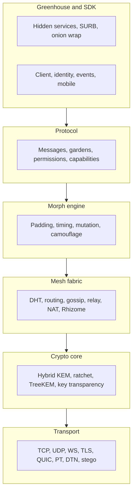

<div align="center">


# libtrellis

**Post-quantum, onion-routed, traffic-morphing mesh — in portable C11.**


</div>

---

`libtrellis` is the reference C implementation of the [Bloom Protocol](https://bloomprotocol.org): a transport-agnostic, post-quantum secure mesh with polymorphic traffic obfuscation, Tor-style onion circuits, and location-hidden services. It is built to link directly into daemons, CLIs, mobile SDKs, and WASM bundles — no runtime, no ambient network stack, no surprises.

## Contents

- [Highlights](#highlights)
- [Architecture](#architecture)
- [Quick start](#quick-start)
- [Minimal example](#minimal-example)
- [CMake options](#cmake-options)
- [Dependencies](#dependencies)
- [Testing, fuzzing, benchmarks](#testing-fuzzing-benchmarks)
- [Repository layout](#repository-layout)
- [Implementation status](#implementation-status)
- [Security](#security)
- [License](#license)

## Highlights

- **Hybrid post-quantum crypto** — X25519 + ML-KEM-1024 key exchange, Ed25519 + ML-DSA-87 signatures, SLH-DSA-256s long-term backup, all driven by [libsodium](https://doc.libsodium.org) + [liboqs](https://github.com/open-quantum-safe/liboqs).
- **Onion-routed mesh** — Kademlia DHT, three-hop hybrid-KEM circuits, guard pinning, relay incentives, cover-traffic PIR queries.
- **Traffic morphology** — constant-rate padding, timing jitter, metamorphic encoding, and wire camouflage (TLS 1.3, HTTP/2, DNS, QUIC, raw-obfs).
- **Pluggable transports** — TCP, UDP, WebSocket, TLS 1.3, obfs4/snowflake/webtunnel subprocess PT, plus optional QUIC, LoRa, BLE, and WebRTC-steganographic channels.
- **Greenhouse hidden services** — ML-KEM onion descriptors, introduction points, rendezvous, SURBs, reverse proxy, dead-man switch.
- **Rhizome federation** — groves, bridges, and canopy reachability for gossip across independent meshes.
- **STUN / TURN** — RFC 5389 + RFC 5766 server and client, reusable as a standalone relay.
- **TreeKEM group keys** — RFC 9420-style left-balanced tree for forward-secret group chat.
- **Single static library** — one `libtrellis.a`, one public header (`trellis/trellis.h`), zero global state beyond `trellis_crypto_init()`.

## Architecture



Each layer is independently testable and can be consumed in isolation — the SDK is the convenient default, but downstream projects routinely use the crypto, transport, and mesh layers directly.

## Quick start

`libtrellis` is built from the top-level Trellis CMake project, which fetches and pins every non-system dependency.

```bash
# System dependency (libsodium is not vendored)
sudo apt install libsodium-dev

# From the trellis/ repository root (parent of libtrellis/)
cmake -B build -S . \
  -DCMAKE_BUILD_TYPE=Release \
  -DTRELLIS_BUILD_STATIC=ON
cmake --build build -j"$(nproc)"

# Run the test suite
ctest --test-dir build --output-on-failure
```

Build artifacts land in `build/libtrellis/`:

- `libtrellis.a` — static library
- `libtrellis.so` — shared library (when `TRELLIS_BUILD_SHARED=ON`)
- `test_*` — CTest executables
- Headers stay in-tree at `libtrellis/include/trellis/`

## Minimal example

Start a client, generate a fresh identity, and enter the event loop:

```c
#include <trellis/trellis.h>
#include <stdio.h>

int main(void) {
    if (trellis_crypto_init() != TRELLIS_OK) {
        fprintf(stderr, "crypto init failed\n");
        return 1;
    }

    trellis_client_config_t cfg = trellis_client_config_default();
    cfg.guard_enabled = true;
    cfg.morph_cell_mode = true;

    trellis_client_t *client = trellis_client_new(&cfg);
    if (!client) return 1;

    if (trellis_client_start(client) != TRELLIS_OK) {
        trellis_client_free(client);
        return 1;
    }

    printf("trellis %s running; fingerprint ready\n", trellis_version());

    trellis_client_stop(client);
    trellis_client_free(client);
    trellis_crypto_cleanup();
    return 0;
}
```

Link with `-ltrellis -lsodium -loqs -luv -lpthread -lm`.

## CMake options

| Flag | Default | Effect |
|------|---------|--------|
| `TRELLIS_BUILD_STATIC` | ON | Build `libtrellis.a` |
| `TRELLIS_BUILD_SHARED` | OFF | Build `libtrellis.so` |
| `TRELLIS_WITH_TLS` | ON | TLS 1.3 transport via mbedTLS |
| `TRELLIS_WITH_QUIC` | OFF | QUIC transport via ngtcp2 (requires quictls) |
| `TRELLIS_WITH_DTN` | OFF | LoRa and BLE delay-tolerant transports |
| `TRELLIS_WITH_BLUEZ` | OFF | BLE BlueZ D-Bus support (Linux, requires DTN) |
| `TRELLIS_WITH_WEBRTC_STEGO` | OFF | WebRTC steganographic transport (libdatachannel + Opus) |
| `TRELLIS_WITH_POP` | OFF | Real Proof-of-Personhood (default: stub) |
| `TRELLIS_WITH_HCO` | OFF | Real Human Challenge Oracle (default: stub; not yet implemented) |
| `TRELLIS_WITH_LIGHTNING` | OFF | Lightning receipt redemption via lncli + BTCPay |
| `TRELLIS_BUILD_TESTS` | ON | Build CTest suite |
| `TRELLIS_BUILD_FUZZ` | OFF | Build libFuzzer harnesses with ASan |
| `TRELLIS_BUILD_BENCHMARKS` | OFF | Build performance benchmarks |

## Dependencies

| Library | Role | Source |
|---------|------|--------|
| [liboqs](https://github.com/open-quantum-safe/liboqs) 0.12.0 | ML-KEM-1024, ML-DSA-87, SLH-DSA-256s | CMake `FetchContent` |
| [libsodium](https://doc.libsodium.org) >= 1.0.18 | X25519, Ed25519, AES-256-GCM, HKDF, SHAKE-256 | System package |
| [libuv](https://libuv.org) 1.49.2 | Async I/O, event loop | CMake `FetchContent` |
| [mbedTLS](https://github.com/Mbed-TLS/mbedtls) 3.6.2 | TLS 1.3 (optional, `TRELLIS_WITH_TLS`) | CMake `FetchContent` |
| [msgpack-c](https://github.com/msgpack/msgpack-c) 6.1.0 | Encoding mutation (MessagePack) | CMake `FetchContent` |
| [tinycbor](https://github.com/intel/tinycbor) 0.6.0 | Encoding mutation (CBOR) | CMake `FetchContent` |

Only `libsodium` must be present on the host; everything else is fetched, pinned, and built inside the CMake tree.

## Testing, fuzzing, benchmarks

**Tests** run through CTest (`TRELLIS_BUILD_TESTS=ON`, default). Twenty-plus suites cover crypto KATs, mesh, morph, protocol, greenhouse, TreeKEM, onion wrap/peel, adversarial probes, integration, TURN, Rhizome, exit relay, platform abstractions, and end-to-end shell harnesses.

```bash
ctest --test-dir build --output-on-failure
ctest --test-dir build -R test_crypto   # run a single suite
```

**Fuzzing** uses libFuzzer with ASan + UBSan. Sixteen harnesses target the adversarially-exposed parsers (handshake, morph decode, DHT RPC, onion peel, SURB unpack, CBOR message parse, naming records, capabilities, STUN/TURN, relay descriptors, ratchet decrypt, gossip, circuit create, config).

```bash
# From the trellis/ repository root
cmake -B build-fuzz -S . \
  -DTRELLIS_BUILD_FUZZ=ON \
  -DCMAKE_C_COMPILER=clang
cmake --build build-fuzz --target fuzz_all
./build-fuzz/libtrellis/fuzz_handshake corpus/ -max_total_time=300
```

**Benchmarks** measure crypto, mesh, morph, and TURN throughput.

```bash
# From the trellis/ repository root
cmake -B build-bench -S . -DTRELLIS_BUILD_BENCHMARKS=ON
cmake --build build-bench --target run_benchmarks
```

## Repository layout

```
libtrellis/
├── include/trellis/      Public headers (trellis.h is the umbrella)
├── src/
│   ├── crypto/           Layer 1 — hybrid KEM, signatures, ratchet, TreeKEM, KT
│   ├── transport/        Layer 0 — TCP, UDP, WS, TLS, QUIC, PT, DTN, stego
│   ├── mesh/             Layer 2 — DHT, routing, gossip, Rhizome, relays
│   ├── morph/            Layer 3 — padding, timing, mutation
│   ├── protocol/         Layer 4 — gardens, permissions, capabilities, media
│   ├── sybil/            VDF, trust graph, PoP, HCO, composite scoring
│   ├── greenhouse/       Hidden services, onion, rendezvous, SURBs
│   ├── turn/             STUN (RFC 5389) + TURN (RFC 5766)
│   └── sdk/              Client, events, config, identity, mobile
├── tests/                CTest + shell harnesses + fuzz entrypoints
├── benchmarks/           Performance benchmarks
└── CMakeLists.txt
```

## Implementation status

> **Why this table exists.** The Bloom whitepaper describes the full target
> architecture. Not every described capability is fully deployed in the current
> codebase. This table maps each subsystem to its actual state so that users,
> auditors, and contributors know exactly what protections are in place today.
> If you are making security claims based on Bloom / Trellis, reference this
> table — not the whitepaper alone.

Status labels:

- **Complete** — fully implemented and tested
- **Complete (flag)** — fully implemented, but requires an optional CMake flag to compile
- **Partial** — implemented with known limitations (see notes)
- **Stub** — API surface exists; implementation is a no-op or always-pass placeholder
- **Removed** — described in the spec but removed from the production build

### Crypto core

| Subsystem | Source | Status | Notes |
|-----------|--------|--------|-------|
| Crypto init / teardown | `crypto/init.c` | Complete | `trellis_crypto_init` / `trellis_crypto_cleanup`; wraps `sodium_init` + `OQS_init` |
| Composite identity | `crypto/identity.c` | Complete | Whitepaper §5.2 composite keys (Ed25519 + ML-DSA + X25519 + ML-KEM + SLH-DSA); SHAKE-256 fingerprint |
| Hybrid handshake (X25519 + ML-KEM-1024) | `crypto/handshake.c` | Complete | 3-message hybrid KEM with dual signatures, Elligator2 obfuscation, HKDF session keys |
| PQ ratchet | `crypto/ratchet.c` | Complete | HKDF symmetric chain with periodic ML-KEM ratchet steps + AES-GCM |
| TreeKEM (group keys) | `crypto/treekem.c` | Complete | RFC 9420-style left-balanced tree; not full MLS interop |
| Key transparency | `crypto/key_transparency.c` | Complete | Chained KT log entries, DHT publish/verify, TOFU cache |
| Elligator2 | `crypto/elligator2.c` | Complete | Point encoding for indistinguishable key material |
| Probe resistance | `crypto/probe_resist.c` | Complete | |
| Connection proof-of-work | `crypto/conn_pow.c` | Complete | |
| KDF / symmetric / signing / KEM | `crypto/kdf.c`, `symmetric.c`, `sign.c`, `kem.c` | Complete | Thin wrappers over libsodium + liboqs |

### Transport

| Subsystem | Source | Status | Notes |
|-----------|--------|--------|-------|
| TCP | `transport/tcp.c` | Complete | |
| UDP | `transport/udp.c` | Complete | |
| WebSocket | `transport/websocket.c` | Complete | |
| TLS 1.3 | `transport/tls.c` | Complete | Requires mbedTLS (`TRELLIS_WITH_TLS`, on by default) |
| Multiplexer | `transport/multiplexer.c` | Complete | |
| Pluggable transports | `transport/pt_subprocess.c` | Complete | obfs4, snowflake, webtunnel via subprocess |
| Wire camouflage | `transport/camouflage.c` | Complete | TLS 1.3 / HTTP/2 / DNS / QUIC / raw-obfs mimicry |
| QUIC (RFC 9000 + MASQUE) | `transport/quic.c` | Complete (flag) | Requires `TRELLIS_WITH_QUIC` + quictls; returns NULL without flag |
| BLE | `transport/ble.c` | Partial (flag) | Requires `TRELLIS_WITH_DTN`. Framing and DTN queue work; BlueZ D-Bus integration limited (hardcoded GATT paths, no persistent server) |
| LoRa | `transport/lora.c` | Complete (flag) | Requires `TRELLIS_WITH_DTN`. Serial AT commands, on-disk DTN bundles, chunking |
| WebRTC steganographic | `transport/webrtc_stego.c` | Partial (flag) | Requires `TRELLIS_WITH_WEBRTC_STEGO`. Outbound LSB stego + Opus works; inbound signaling and RS-FEC decode path incomplete |

### Mesh fabric

| Subsystem | Source | Status | Notes |
|-----------|--------|--------|-------|
| Kademlia DHT | `mesh/dht.c` | Complete | |
| Routing | `mesh/routing.c` | Complete | |
| Gossip protocol | `mesh/gossip.c` | Complete | |
| Relay forwarding | `mesh/relay.c` | Complete | |
| Relay descriptors | `mesh/relay_descriptor.c` | Complete | Signed self-published metadata (capabilities, exit policy, bandwidth); Ed25519 + ML-DSA; DHT-keyed by fingerprint |
| Topology | `mesh/topology.c` | Complete | |
| NAT traversal | `mesh/nat.c` | Complete | |
| PIR (private info retrieval) | `mesh/pir.c` | Complete | Cover-query design (real + decoy DHT lookups); not full cryptographic single-server PIR |
| Relay incentive | `mesh/incentive.c` | Complete | Ed25519-signed bandwidth receipts. Lightning settlement behind `TRELLIS_WITH_LIGHTNING` (requires lncli at runtime) |
| Guard pinning | `mesh/guard.c` | Complete | |
| Bootstrap | `mesh/bootstrap.c` | Complete | |
| Warrant canary | `mesh/canary.c` | Complete | |
| Naming / petnames | `mesh/naming.c` | Complete | Minor discrepancy: header says SHAKE-256 for DHT key, code uses SHA-256 |
| Exit relay | `mesh/exit_relay.c` | Complete | SOCKS5 + DoH resolve + stream protocol |
| Dead drop | `mesh/deaddrop.c` | Complete | |
| Flow control | `mesh/flow.c` | Complete | |
| Clock sync | `mesh/clock_sync.c` | Complete | |
| Circuit pool | `mesh/circuit_pool.c` | Complete | |
| DoH resolver | `mesh/doh.c` | Complete | |
| Grove (Rhizome) | `mesh/grove.c` | Complete | Local grove management, membership, admin rules, DHT binding. **Not validated in a multi-grove federation at scale** |
| Bridge | `mesh/bridge.c` | Complete | Attestations, multi-grove forwarding, policy |
| Canopy | `mesh/canopy.c` | Complete | Reachability announcements, direct routing |
| Rhizome federation (overall) | grove + bridge + canopy + gossip | Partial | Individual components work; **cross-grove federation has not been deployed or tested at production scale** |

### Morph engine

| Subsystem | Source | Status | Notes |
|-----------|--------|--------|-------|
| Traffic shaping (padding + timing) | `morph/padding.c`, `morph/timing.c` | Complete | Constant-rate padding, timing jitter |
| Metamorphic encoding | `morph/mutation.c`, `morph/engine.c` | Complete | Rotating epoch magic, encode/decode |
| Adaptive mimicry probes | `morph/engine.c` | Complete | Profile selection via TCP probes to well-known endpoints (disabled in Emscripten builds) |
| Disguise codecs | — | Removed | Described in whitepaper; **removed from production C core**. CMake: *"traffic shaping only — disguise codecs removed"* |

### Protocol

| Subsystem | Source | Status | Notes |
|-----------|--------|--------|-------|
| Message framing | `protocol/messages.c` | Complete | |
| Garden (rooms/channels) | `protocol/garden.c` | Complete | |
| Permissions | `protocol/permissions.c` | Complete | |
| Capabilities | `protocol/capabilities.c` | Complete | |
| Extensions | `protocol/extensions.c` | Complete | |
| WebRTC media | `protocol/webrtc_media.c` | Complete | |

### Sybil resistance

| Subsystem | Source | Status | Notes |
|-----------|--------|--------|-------|
| VDF proof-of-work | `sybil/vdf.c` | Complete | |
| Trust graph | `sybil/trust.c` | Complete | |
| Behavioral scoring | `sybil/behavior.c` | Complete | |
| Proof-of-personhood | `sybil/personhood.c` | Complete | Ristretto-based partial issuance, Schnorr presentations, caching |
| Human Challenge Oracle (HCO) | `sybil/hco.c` | **Stub** | **`trellis_hco_verify` always returns OK; `trellis_hco_freshness` always returns 1.0.** Enabling `TRELLIS_WITH_HCO` fails compilation — no real implementation exists yet |
| Composite scoring | `sybil/composite.c` | Complete | Aggregates VDF + trust + behavior + PoP + HCO scores |
| Bridge trust | `sybil/bridge_trust.c` | Complete | |

### Greenhouse (hidden services)

| Subsystem | Source | Status | Notes |
|-----------|--------|--------|-------|
| Onion wrap / peel | `greenhouse/onion.c` | Complete | Hybrid KEM per-hop, multi-layer AES-GCM |
| Descriptor | `greenhouse/descriptor.c` | Complete | |
| Addressing | `greenhouse/addressing.c` | Complete | |
| Introduction points | `greenhouse/introduction.c` | Complete | |
| Rendezvous | `greenhouse/rendezvous.c` | Complete | |
| Service lifecycle | `greenhouse/service.c` | Partial | Descriptor build, intro points, DHT publish work. Rendezvous bridging has caveats (circuit rebuild on dead intro is reactive, not proactive). **Not end-to-end validated at scale** |
| Proxy / reverse proxy | `greenhouse/proxy.c`, `reverse_proxy.c` | Complete | |
| Dead man switch | `greenhouse/deadman.c` | Complete | |
| SURB (single-use reply blocks) | `greenhouse/surb.c` | Complete | |

### TURN / STUN

| Subsystem | Source | Status | Notes |
|-----------|--------|--------|-------|
| STUN (RFC 5389) | `turn/stun.c` | Complete | Binding request/response with XOR-MAPPED-ADDRESS |
| TURN (RFC 5766) | `turn/turn.c` | Complete | Allocate, Refresh, CreatePermission, ChannelBind, ChannelData, Send/Data |

### SDK

| Subsystem | Source | Status | Notes |
|-----------|--------|--------|-------|
| Client | `sdk/client.c` | Complete | |
| Events | `sdk/events.c` | Complete | |
| Config | `sdk/config.c` | Complete | |
| Discovery | `sdk/discovery.c` | Complete | |
| Identity store | `sdk/identity_store.c` | Complete | |
| Identity recovery | `sdk/identity_recovery.c` | Complete | |
| Metrics | `sdk/metrics.c` | Complete | |
| Control | `sdk/control.c` | Complete | |
| Mobile | `sdk/mobile.c` | Partial | Battery-driven cover scaling and consume-only mode work. DHT mobile peer limits described in header are not wired in code |

### Summary of gaps

The following items are described in the Bloom whitepaper but are **not fully
available** in the current libtrellis build:

1. **Morph disguise codecs** — removed from the C core. Only traffic shaping
   (padding, timing, metamorphic encoding) is active.
2. **HCO (Human Challenge Oracle)** — stub only. Verification always passes.
   No real implementation exists behind the `TRELLIS_WITH_HCO` flag.
3. **Rhizome federation** — grove, bridge, and canopy components are
   implemented and unit-tested, but cross-grove federation has not been
   deployed or validated at production scale.
4. **Greenhouse service lifecycle** — core primitives (onion, descriptors,
   intro points) are complete; the full end-to-end service flow has caveats
   and has not been validated at scale.
5. **Optional transports (QUIC, BLE, LoRa, WebRTC stego)** — require explicit
   CMake flags. Users building without these flags get NULL-returning stubs.
   BLE and WebRTC stego are partial even when enabled.
6. **Mobile SDK** — DHT mobile peer limits are specified in the header but
   not enforced in code.

> This table should be updated whenever a subsystem's status changes. If you
> are making or evaluating security claims about Bloom, check this table first.

## Security

`libtrellis` is a security-critical library. It has not yet undergone an independent audit. Until it has, treat all deployments as experimental.

If you believe you have found a vulnerability, **do not** open a public issue. Email the maintainers directly or follow the disclosure process documented in the top-level Bloom repository. Coordinated disclosure is welcome and appreciated.

Fuzz harnesses (see [Testing, fuzzing, benchmarks](#testing-fuzzing-benchmarks)) are expected to run clean under libFuzzer + ASan + UBSan before any release tag.

## License

The Trellis source code and all Bloom-related code in this repository are Copyright (c) 2024-2026 cRash, licensed under the **GNU Lesser General Public License v3.0 with the additional terms** in [LICENSE](../LICENSE). See [NOTICE](../NOTICE) for component attribution.
